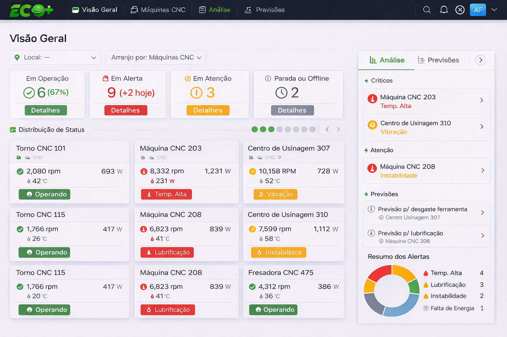
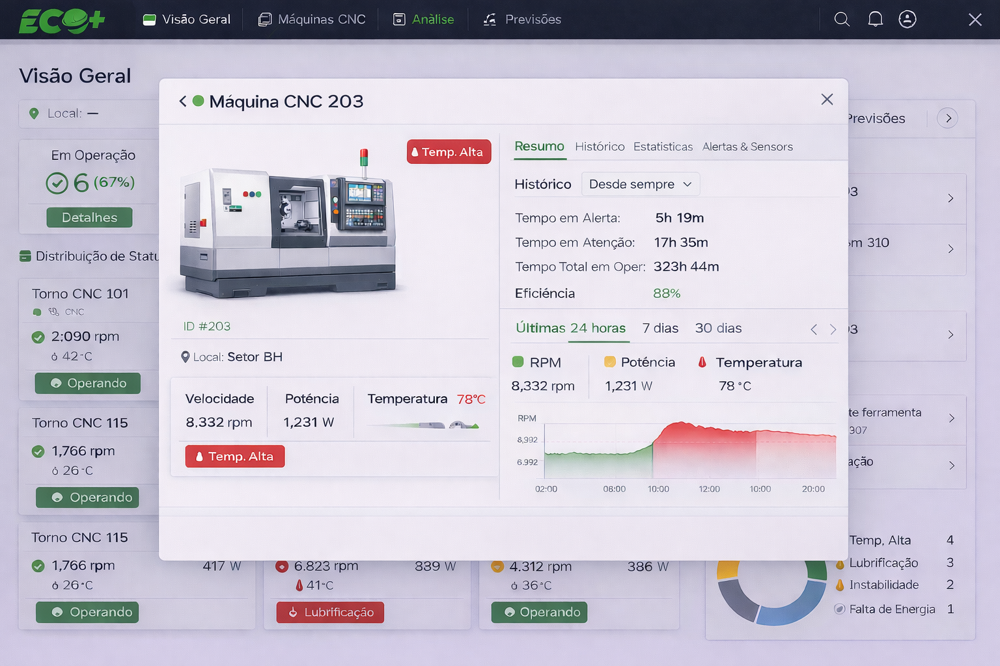

# Desafio Técnico – Front-End (React)

Crie uma aplicação web em **React** para monitoramento e gestão de máquinas industriais. O objetivo é consumir dados de uma API para **listar máquinas**, **exibir detalhes** e **atualizar metadados** (nome, descrição, localização). A ênfase está na **qualidade da interface**, na **eficiência das requisições** e na **organização e limpeza do código**. A integração com serviços em **cloud** (deploy, CI/CD, containers) será considerada um diferencial.

## Visão Geral



Uma empresa monitora várias máquinas em tempo real. Para este desafio, você desenvolverá uma interface de gerenciamento que permita:

- **Listar máquinas**: exiba todas as máquinas com informações como nome, velocidade (RPM), potência, temperatura e status (Operando, Alerta, Em atenção, Offline etc.). A listagem deverá ser carregada através de uma requisição `GET` à API.
- **Exibir detalhes**: ao selecionar uma máquina, apresente um modal com detalhes adicionais (imagem da máquina, histórico de tempos em alerta/atenção/operação, eficiência, gráficos de RPM/potência/temperatura etc.). A interface deve se inspirar nas telas de referência incluídas (`interface.png` e `modal.png`) e pode ser incrementada com componentes gráficos de sua escolha.
- **Atualizar informações**: implemente uma chamada `POST` à API para atualizar os **metadados** de uma máquina (por exemplo, alterar nome, descrição ou local). O envio deve ser realizado em formato JSON e contemplar tratamento de erros.

O foco está em entregar uma **experiência de usuário fluida**, com **reutilização de componentes**, **tratamento de estados de carregamento/erro**, organização de pastas e arquivos e boas práticas de desenvolvimento em React (hooks, divisão de responsabilidade e testes, se possível).



## Estrutura sugerida do repositório

Para se organizar, você pode seguir uma estrutura de pastas similar à abaixo, mas sinta-se livre para adaptá-la conforme seu estilo de desenvolvimento. O importante é manter uma organização clara e lógica, com separação entre componentes, serviços e estilos.

```text
├── README.md                 # instruções do desafio
├── .env.example              # exemplo de variáveis de ambiente (credenciais da API)
├── package.json              # dependências e scripts
├── public/
│   └── index.html            # arquivo HTML principal
├── src/
│   ├── App.js                # componente raiz
│   ├── index.js              # ponto de entrada do React
│   ├── components/           # componentes reutilizáveis (card da máquina, modal etc.)
│   ├── pages/                # páginas (lista de máquinas, página de análise etc.)
│   ├── services/             # módulo de comunicação com a API (métodos GET/POST)
│   ├── hooks/                # hooks customizados (ex.: useMachines, useAPI)
│   ├── styles/               # arquivos de estilo (CSS Modules, Styled Components etc.)
│   └── assets/               # imagens ou ícones adicionais
└── images/
    ├── interface.png             # página de referência da interface principal
    └── modal.png                 # modal de referência
````

## Requisitos

Para executar o desafio, você precisará dos seguintes itens instalados:

* **Node.js** (versão 16 ou superior) e **npm** ou **yarn** para gerenciar dependências.
* **Git** para clonar o repositório e versionar seu código.
* Um editor de código de sua preferência (VS Code, WebStorm, etc.).
* Acesso à **API** da empresa (as credenciais serão fornecidas mais abaixo). 

## Configuração

1. **Clone** este repositório.
2. Copie o arquivo de variáveis de ambiente de exemplo e renomeie para `.env`:

```bash
cp .env.example .env
```

3. Preencha as variáveis de ambiente conforme as credenciais fornecidas. Abaixo, seguem as credenciais:


> API_URL=https://api.ecoautomacao.com.br
>
> API_AUTH_TYPE=basic
>
> API_USER=eco_user
>
> API_PASSWWORD=enemy-banana-ahead

4. Definição do `package.json` com as dependências necessárias para o projeto. Certifique-se de incluir bibliotecas para requisições HTTP, para roteamento, e de visualização dos dados.

5. Instale as dependências do projeto:

```bash
npm install
# ou
yarn
```

6. Inicie o servidor de desenvolvimento:

```bash
npm start
# ou
yarn start
```

O aplicativo será servido por padrão em `http://localhost:3000`.

## Integração com a API

A comunicação com a API deve estar centralizada em um módulo ou serviço dedicado, por exemplo `src/services/api.js`. Use `fetch`, `axios` ou outra biblioteca de sua preferência, lembrando de reutilizar configuração de headers, autenticação e tratamento de erros.

### Endpoint GET – Listar máquinas

* **Descrição:** obtém a lista de todas as máquinas monitoradas.
* **Exemplo de requisição:**

```js
// src/services/api.js
import axios from 'axios';

const api = axios.create({
  baseURL: process.env.REACT_APP_API_BASE_URL,
  auth: {
    username: process.env.REACT_APP_API_USER,
    password: process.env.REACT_APP_API_PASS,
  },
  headers: {
    'Content-Type': 'application/json',
    'x-api-key': process.env.REACT_APP_API_KEY,
  },
});

export async function fetchMachines() {
  const response = await api.get('/maquinas');
  return response.data;
}
```

* **Resposta esperada:** um array de objetos representando máquinas. Os dados de sensores (RPM, potência e temperatura) **não ficam no nível raiz**, mas sim dentro de um campo `dados`, que é uma lista de medições ao longo do tempo. Cada objeto deve conter pelo menos:

```json
[
  {
    "id": 203,
    "codigo": "Máquina CNC 203",
    "local": "Setor BH",
    "status": "Temp. Alta",
    "alertas": ["Temp. Alta"],
    "ultimaAtualizacao": "2026-03-17T14:00:00-03:00",
    "dados": [
      {
        "timestamp": "2026-03-17T13:55:00-03:00",
        "rpm": 8332,
        "potencia": 1231,
        "temperatura": 78
      },
      {
        "timestamp": "2026-03-17T14:00:00-03:00",
        "rpm": 8290,
        "potencia": 1220,
        "temperatura": 79
      }
    ]
  },
  {
    "id": 101,
    "codigo": "Torno CNC 101",
    "local": "CNC",
    "status": "Operando",
    "alertas": [],
    "ultimaAtualizacao": "2026-03-17T14:05:00-03:00",
    "dados": [
      {
        "timestamp": "2026-03-17T14:00:00-03:00",
        "rpm": 2080,
        "potencia": 693,
        "temperatura": 42
      }
    ]
  }
]
```

> Os campos podem variar conforme a API real; ajuste o modelo para refletir as propriedades disponibilizadas. Use o campo `dados` para gerar gráficos e cálculos na interface.

### Endpoint POST – Atualizar máquina

* **Descrição:** atualiza os **metadados** de uma máquina específica. Este endpoint tem como foco modificar campos como `nome`, `descricao` ou `local`, e não os dados de sensores. Use `POST /maquinas/:id` conforme a API fornecida.
* **Exemplo de requisição:**

```js
export async function updateMachine(id, payload) {
  // Exemplo de payload: { nome: 'Torno CNC 203', descricao: 'Revisada', local: 'Setor B' }
  const response = await api.post(`/maquinas/${id}`, payload);
  return response.data;
}
```

* **Corpo (payload):** objeto JSON com os metadados a serem atualizados (por exemplo, `nome`, `descricao`, `local`). Não inclua dados de sensores aqui; estes são coletados automaticamente pela API.
* **Resposta esperada:** objeto da máquina atualizado ou mensagem de sucesso/erro, conforme a especificação da API.

Implemente tratamento de erros e loading state no front-end; por exemplo, exiba mensagens de falha quando a API estiver indisponível ou retornar erro de validação.

## Requisitos funcionais

1. **Dashboard de Visão Geral**

   * Apresente métricas resumidas como quantidade de máquinas em operação, em alerta, em atenção e paradas/offline.
   * Mostre um gráfico ou donut com a distribuição de alertas por tipo (Temperatura alta, Lubrificação, Instabilidade, Falta de energia etc.).
   * Disponibilize filtros (por exemplo, por local ou tipo de máquina) para facilitar a visualização.

2. **Listagem de máquinas**

   * Cada máquina deve aparecer como um cartão contendo seu nome, ícones de status, valores de velocidade, potência, temperatura e um indicador colorido de alerta (verde para operando, vermelho para alerta, amarelo para atenção etc.).
   * Os cartões devem ser responsivos e dispostos em grade, adaptando-se a diferentes tamanhos de tela.

3. **Modal de detalhes**

   * Ao clicar em um cartão, mostre um modal detalhado com a imagem da máquina, informações de localização e outras métricas. Use abas para separar seções como **Resumo**, **Histórico**, **Estatísticas** e **Alertas & Sensores**, semelhante à interface de referência.
   * Exiba gráficos (linha, área ou barra) mostrando a variação de RPM, potência e temperatura nos últimos 24 h / 7 dias / 30 dias.

4. **Atualização de máquina**

   * Permita que o usuário modifique metadados de uma máquina, como `nome`, `descricao` ou `local`. Após a alteração, chame o endpoint POST/PUT e atualize a interface conforme a resposta.
   * A interface deve informar o sucesso ou falha da operação, sem recarregar a página.
   * A operação não irá de fato alterar os metadados do sistema, mas deve realizar a chamada à API e tratar a resposta como se fosse real.

## Critérios de avaliação

O seu projeto será avaliado com base nos seguintes pontos:

* **Fidelidade da interface:** quão próximo seu layout está das imagens de referência e quão intuitiva é a experiência para o usuário.
* **Qualidade do código:** organização de arquivos, componentização, clareza, uso adequado de hooks, reaproveitamento e legibilidade. Evite código duplicado e prefira funções puras.
* **Eficiência das requisições:** evite chamadas desnecessárias, reutilize conexões e considere estratégias como caching ou debounce quando apropriado.
* **Tratamento de erros e estados:** carregamento, mensagens de erro e feedback ao usuário devem estar presentes.
* **Versionamento e histórico de commits:** utilize mensagens de commit claras e constantes. Histórias de desenvolvimento são apreciadas.
* **Documentação:** mantenha o README atualizado com instruções claras de instalação e execução. Comente trechos relevantes do código quando necessário.
* **Diferenciais:** uso de TypeScript, testes unitários (Jest + React Testing Library), integração contínua (GitHub Actions), deploy em nuvem (Vercel, Netlify, AWS), e containerização com Docker.

## Como enviar

1. **Crie um repositório** em sua conta do GitHub com o código do desafio.
2. Certifique-se de que o projeto pode ser executado seguindo as instruções de configuração do README.
3. Opcionalmente, hospede uma versão funcional em algum provedor de cloud ou serviço de deploy (por exemplo, Vercel, Netlify, AWS Amplify). O link de demonstração é um diferencial, mas não obrigatório.
4. Envie o link do seu repositório para `rh@ecoautomacao.com.br`, com cópia para seu responsável técnico. 

---

**Boa sorte!**